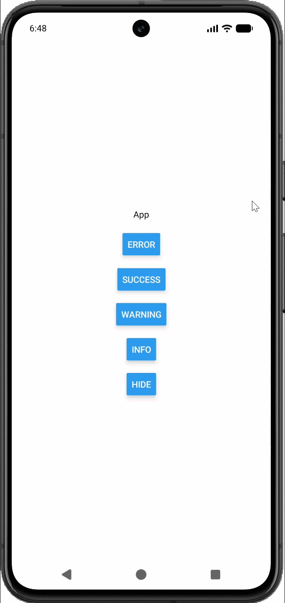

# react-native-toast
A simple toast notification created with reanimated for React Native.

## Required Packages
- zustand
- react-native-reanimated
- react-native-worklets
- react-native-safe-area-context
- @react-native-vector-icons/feather

## Usage
Add `<Toast />` as the last component.
```tsx
export default function App() {
    return (
        <SafeAreaProvider>
            <RenderApp />
            <Toast />
        </SafeAreaProvider>
    );
}
```

## Show Toast
```tsx
import { TGoster } from 'toast';

TGoster(type, 'title', 'content', time);

// type: "success" | "error" | "warning" | "info" 
// time default 3000
```

## Hide Toast
```tsx
import { TGizle } from 'toast';

TGizle();
```

## Preview

